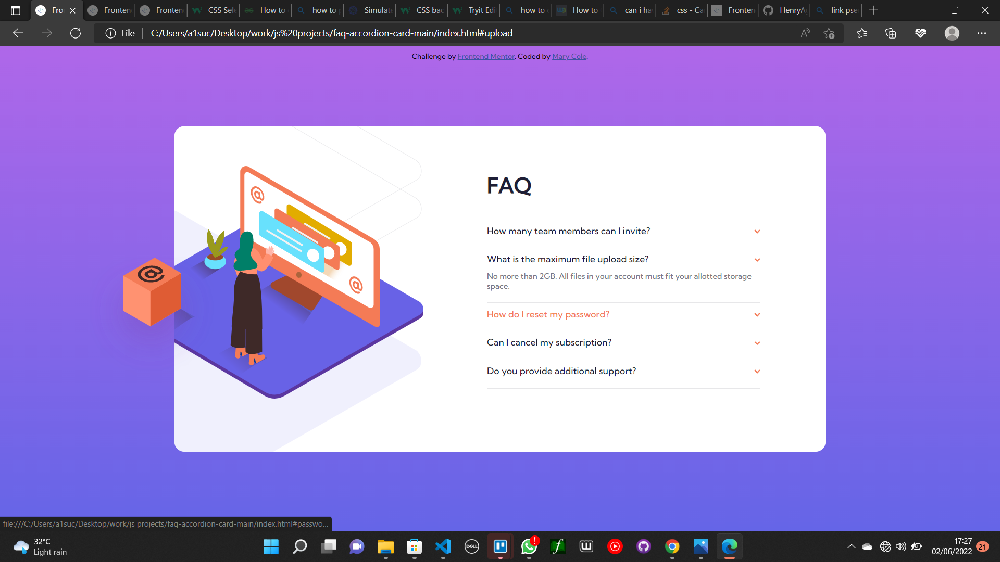

# Frontend Mentor - FAQ accordion card solution

This is a solution to the [FAQ accordion card challenge on Frontend Mentor](https://www.frontendmentor.io/challenges/faq-accordion-card-XlyjD0Oam). Frontend Mentor challenges help you improve your coding skills by building realistic projects. 

## Table of contents

- [Overview](#overview)
  - [The challenge](#the-challenge)
  - [Screenshot](#screenshot)
  - [Links](#links)
- [My process](#my-process)
  - [Built with](#built-with)
  - [What I learned](#what-i-learned)
  - [Continued development](#continued-development)
  - [Useful resources](#useful-resources)
- [Author](#author)

## Overview

### The challenge

Users should be able to:

- View the optimal layout for the component depending on their device's screen size
- See hover states for all interactive elements on the page
- Hide/Show the answer to a question when the question is clicked

### Screenshot



### Links

- Solution URL: [Solution URL](https://github.com/adebimpecole/faq-accordion-card.git)
- Live Site URL: [Live site URL](https://shiny-arithmetic-8ad2bf.netlify.app/)

## My process

### Built with

- Semantic HTML5 markup
- CSS custom properties
- Flexbox
- CSS Grid
- Mobile-first workflow

### What I learned

I learnt how to applu onclick event to my document using only css. I also learnt the importance of pseudo classes, background image placements and how to give the source attribute of an image using css.


```css
#team:target, #upload:target, #password:target, #sub:target, #support:target{
    display: block;
}
#woman{
    ...
    content: url("images/illustration-woman-online-desktop.svg");
}
```

### Continued development
- Linear gradient
- Pseudo classes
- Grid

**Note: Delete this note and the content within this section and replace with your own plans for continued development.**

### Useful resources

- [Example resource 1](https://www.w3schools.com/css/css_pseudo_classes.asp) - This helped me in selecting which pseudo class to use for my links and their order
- [Example resource 2](https://www.delftstack.com/howto/css/css-onclick/) - This helped me understand how to put onclick events on my links using css

## Author

- Website - [Cole Mary](https://shiny-arithmetic-8ad2bf.netlify.app/)
- Frontend Mentor - [@adebimpecole](https://www.frontendmentor.io/profile/adebimpecole)
- Twitter - [@adecole02](https://twitter.com/adecole02)


